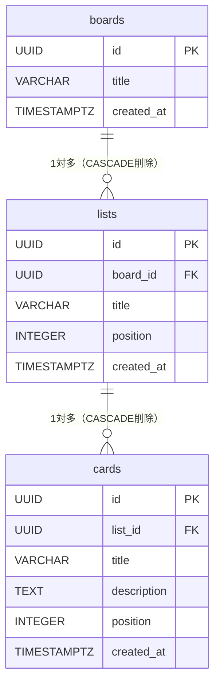

# データベース設計 — Trello風タスク管理アプリ

> 上位ドキュメント: [要件定義書](./requirements.md)

---

## 1. アプリケーション上の型定義（フェーズ1・2共通）

```typescript
interface Card {
  id: string;           // ユニークID
  title: string;        // カードタイトル（必須）
  description: string;  // 説明文（任意、空文字許容）
  createdAt: number;    // 作成日時（Unix timestamp ms）
}

interface List {
  id: string;       // ユニークID
  title: string;    // リストタイトル
  cards: Card[];    // カードの配列（インデックス順が表示順）
}

interface Board {
  id: string;       // ユニークID
  title: string;    // ボードタイトル
  lists: List[];    // リストの配列（インデックス順が表示順）
  createdAt: number;
}
```

---

## 2. ER図（フェーズ2: PostgreSQL）



---

## 3. テーブル定義

```sql
CREATE TABLE boards (
  id         UUID PRIMARY KEY DEFAULT gen_random_uuid(),
  title      VARCHAR(255) NOT NULL,
  created_at TIMESTAMPTZ  NOT NULL DEFAULT now()
);

CREATE TABLE lists (
  id         UUID PRIMARY KEY DEFAULT gen_random_uuid(),
  board_id   UUID         NOT NULL REFERENCES boards(id) ON DELETE CASCADE,
  title      VARCHAR(255) NOT NULL,
  position   INTEGER      NOT NULL,  -- 表示順（0始まり）
  created_at TIMESTAMPTZ  NOT NULL DEFAULT now()
);

CREATE TABLE cards (
  id          UUID PRIMARY KEY DEFAULT gen_random_uuid(),
  list_id     UUID         NOT NULL REFERENCES lists(id) ON DELETE CASCADE,
  title       VARCHAR(255) NOT NULL,
  description TEXT         NOT NULL DEFAULT '',
  position    INTEGER      NOT NULL,  -- リスト内の表示順（0始まり）
  created_at  TIMESTAMPTZ  NOT NULL DEFAULT now()
);
```

---

## 4. リレーション

| 親テーブル | 子テーブル | 種別 | 削除時の挙動 |
|-----------|-----------|------|------------|
| `boards` | `lists` | 1対多 | CASCADE（ボード削除でリストも削除） |
| `lists` | `cards` | 1対多 | CASCADE（リスト削除でカードも削除） |

- `position` カラムで表示順を管理する（0始まりの整数）
- カードをリスト間で移動した場合、`list_id` と `position` の両方を更新する
