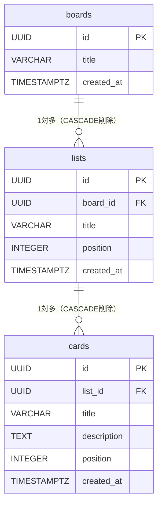

# 要件定義書 — Trello風タスク管理アプリ

## 改訂履歴

| バージョン | 日付 | 変更内容 | 担当 |
|-----------|------|---------|------|
| 1.0 | 2026-05-12 | 初版作成 | johmen |
| 1.1 | 2026-05-16 | 画面仕様・技術選定・ユースケース追加 | johmen |
| 2.0 | 2026-05-16 | フルスタック版として再構成。ER図・API設計・フェーズ計画追加 | johmen |

---

## 1. プロジェクト概要

| 項目 | 内容 |
|------|------|
| プロジェクト名 | Trello風タスク管理アプリ |
| 作成日 | 2026-05-12 |
| フロントエンド | React 19 / TypeScript / Vite / @dnd-kit |
| バックエンド | Node.js / Express |
| データベース | PostgreSQL |
| デプロイ | ローカル環境のみ |

---

## 2. 背景・目的

本プロジェクトは、Webフロントエンド開発スクールの課題として実施するものである。

### 2.1 学習目的

以下の技術・概念の実践的な習得を目的とする。

| フェーズ | 学習項目 | 習得内容 |
|---------|---------|---------|
| フェーズ1 | React 19 | コンポーネント設計、状態管理（useState）、カスタムフック |
| フェーズ1 | TypeScript | 型定義、インターフェース設計、型安全なコーディング |
| フェーズ1 | ドラッグ&ドロップ | @dnd-kit を用いたインタラクション実装 |
| フェーズ1 | データ永続化（簡易） | localStorage を用いたブラウザ内データ保存 |
| フェーズ2 | REST API設計 | エンドポイント設計・HTTPメソッドの使い分け |
| フェーズ2 | Node.js + Express | サーバーサイドのルーティング・ミドルウェア構成 |
| フェーズ2 | PostgreSQL | テーブル設計・SQL・ORMの活用 |
| フェーズ2 | フルスタック連携 | フロントエンドからAPIを叩き、DBのデータを画面に反映する |

### 2.2 成果物の位置づけ

- スクール提出用の課題成果物として作成する
- 実務に近い要件定義・設計プロセスを経験することも目的の一つとする
- マルチユーザー・認証は学習スコープ外とし、シングルユーザー前提で完結させる

---

## 3. スコープ

### 対象（In Scope）

- カンバンボードのUI実装（ボード・リスト・カード）
- ドラッグ&ドロップによる並び替え・移動
- フェーズ1：localStorageによるデータ永続化
- フェーズ2：REST APIおよびPostgreSQLによるデータ永続化

### 対象外（Out of Scope）

| 項目 | 理由 |
|------|------|
| ユーザー認証・ログイン | 学習スコープ外 |
| マルチユーザー・チームコラボレーション | シングルユーザー前提 |
| 複数ボード管理 | 単一ボードのみ対象 |
| リアルタイム同期（WebSocket等） | 対象外 |
| モバイル最適化 | デスクトップブラウザを主対象とする |
| 外部サービスへのデプロイ・公開 | ローカル動作のみ対象 |

---

## 4. 用語定義

| 用語 | 定義 |
|------|------|
| ボード | アプリ全体のワークスペース。1つのボードが1つのカンバン画面に対応する |
| リスト | ボード上に横並びで表示される列。タスクのカテゴリ（例：To Do）に相当する |
| カード | 各リストに属するタスクの単位。タイトルと説明文を持つ |
| ドラッグ&ドロップ | カードをマウスで掴んで別の位置に移動する操作 |
| インライン編集 | 別画面に遷移せず、その場でテキストを編集できる操作 |
| REST API | HTTPを使ってデータの取得・作成・更新・削除を行うインターフェース |
| ORM | オブジェクトとDBテーブルを対応付けてSQLを自動生成するライブラリ |

---

## 5. ユーザーと想定環境

### 5.1 ユーザー

| 区分 | 説明 |
|------|------|
| 主対象 | 作者本人（課題提出・学習目的） |
| 副対象 | 採点者・レビュアー（スクール講師） |

### 5.2 利用環境

| 項目 | 内容 |
|------|------|
| 対応ブラウザ | Chrome / Edge / Firefox 最新版 |
| デバイス | デスクトップPC・ノートPC |
| 画面解像度 | 1280px 幅以上を推奨 |
| ネットワーク | フェーズ1：不要。フェーズ2：ローカルネットワーク（localhost）のみ |

---

## 6. 開発フェーズ

| フェーズ | 内容 | データ保存 | 状態 |
|---------|------|-----------|------|
| フェーズ1 | フロントエンドのみ実装 | localStorage | 完了 |
| フェーズ2 | バックエンド + DB を追加 | PostgreSQL（REST API経由） | 予定 |

フェーズ2では、フロントエンドのデータアクセス層を localStorage から REST API 呼び出しに切り替える。UIの変更は最小限に抑える。

---

## 7. ユースケース

### UC-01: タスクを追加する

| 項目 | 内容 |
|------|------|
| アクター | ユーザー |
| 事前条件 | ボードが表示されており、リストが1つ以上存在する |
| 基本フロー | 1. リスト下部の「+ カードを追加」をクリックする<br>2. 入力フォームが展開される<br>3. タイトルを入力する（必須）<br>4. 説明文を入力する（任意）<br>5. 「追加」ボタンをクリックするか Enter を押す<br>6. カードがリストの末尾に追加される |
| 代替フロー | 5a. Escape キーを押した場合 → フォームを閉じ、入力を破棄する |
| 例外フロー | 5b. タイトルが空の場合 → 追加されない（フォームは閉じない） |
| 事後条件 | カードがリストに表示され、保存される（フェーズ1: localStorage、フェーズ2: DB） |

---

### UC-02: タスクを別のリストへ移動する

| 項目 | 内容 |
|------|------|
| アクター | ユーザー |
| 事前条件 | ボードにカードが1枚以上存在し、リストが2つ以上存在する |
| 基本フロー | 1. 移動したいカードをマウスで長押し（ドラッグ開始）<br>2. カードが半透明になり、ドラッグオーバーレイが表示される<br>3. 別のリスト上にドラッグする<br>4. 挿入位置のプレビューが表示される<br>5. マウスを離す（ドロップ）<br>6. カードが新しい位置に移動する |
| 代替フロー | 5a. 元の位置に戻した場合 → カードは移動しない |
| 事後条件 | カードの所属リストと順序が更新・保存される |

---

### UC-03: タスクを編集する

| 項目 | 内容 |
|------|------|
| アクター | ユーザー |
| 事前条件 | 編集対象のカードが存在する |
| 基本フロー | 1. カードにホバーすると編集アイコン（✏️）が表示される<br>2. ✏️をクリックする<br>3. タイトル・説明のインライン編集フォームが展開される<br>4. 内容を変更する<br>5. 「保存」ボタンをクリックするか Enter を押す<br>6. 変更が反映される |
| 代替フロー | 5a. Escape キーを押した場合 → 変更を破棄し元の値に戻る |
| 例外フロー | 5b. タイトルを空にして保存した場合 → 保存されない |
| 事後条件 | カードの内容が更新・保存される |

---

### UC-04: リストを追加する

| 項目 | 内容 |
|------|------|
| アクター | ユーザー |
| 事前条件 | ボードが表示されている |
| 基本フロー | 1. ボード右端の「+ リストを追加」をクリックする<br>2. タイトル入力フィールドが表示される<br>3. タイトルを入力する<br>4. 「追加」ボタンをクリックするか Enter を押す<br>5. 新しいリストがボード右端に追加される |
| 代替フロー | 4a. Escape または「キャンセル」クリックで入力を破棄する |
| 例外フロー | 4b. タイトルが空の場合 → 追加されない |
| 事後条件 | リストがボードに表示・保存される |

---

### UC-05: ページリロード後にデータが復元される

| 項目 | 内容 |
|------|------|
| アクター | ユーザー（ブラウザ） |
| 事前条件 | ボードにデータが存在する状態でページをリロードする |
| 基本フロー | 1. ユーザーがブラウザをリロードする<br>2. アプリが起動する<br>3. データソース（フェーズ1: localStorage / フェーズ2: API）からデータを読み込む<br>4. リロード前と同じボード・リスト・カードが表示される |
| 事後条件 | データが失われていない |

---

## 8. 機能要件

### 8.1 ボード

| # | 機能 | 詳細 |
|---|------|------|
| B-1 | ボードタイトル表示 | ヘッダーにボード名を表示する |
| B-2 | ボードタイトル編集 | タイトルをクリックするとインライン編集できる。Enter またはフォーカスアウトで確定、Escape でキャンセル |

### 8.2 リスト

| # | 機能 | 詳細 |
|---|------|------|
| L-1 | リスト表示 | ボード上に複数のリスト（列）を横並びで表示する |
| L-2 | リスト追加 | 「+ リストを追加」ボタンからリストを新規作成できる |
| L-3 | リストタイトル編集 | タイトルをクリックするとインライン編集できる |
| L-4 | リスト削除 | ✕ ボタンでリストを削除できる（配下のカードも同時に削除） |
| L-5 | 初期リスト | アプリ初回起動時に「To Do」「In Progress」「Done」の3列を自動生成する |

### 8.3 カード

| # | 機能 | 詳細 |
|---|------|------|
| C-1 | カード表示 | タイトルと説明文を表示する |
| C-2 | カード追加 | 各リスト下部の「+ カードを追加」からカードを作成できる。タイトルは必須、説明は任意 |
| C-3 | カード編集 | ✏️ ボタンでタイトル・説明をインライン編集できる |
| C-4 | カード削除 | 🗑️ ボタンでカードを削除できる |
| C-5 | カードのドラッグ&ドロップ | カードを掴んで同一リスト内の並び替え、または別リストへの移動ができる |

### 8.4 データ永続化

| # | 機能 | フェーズ1 | フェーズ2 |
|---|------|---------|---------|
| D-1 | 自動保存 | 変更を localStorage に即時保存 | 変更を REST API 経由で DB に保存 |
| D-2 | 復元 | ページリロード後に localStorage から復元 | ページリロード後に API から復元 |

---

## 9. 非機能要件

| カテゴリ | 要件 | 基準 |
|---------|------|------|
| **対応環境** | ブラウザ | Chrome / Edge / Firefox 最新版 |
| **対応環境** | 画面幅 | 1280px 以上で正常表示（横スクロール対応） |
| **パフォーマンス** | 初期表示 | ページ読み込みから表示完了まで 2秒以内（ローカル環境） |
| **パフォーマンス** | 操作応答 | カード追加・削除・ドラッグ操作は 100ms 以内に画面反映 |
| **信頼性** | データ保持 | 保存済みのデータはリロード後も失われない |
| **保守性** | コード品質 | TypeScript の型定義を適切に行い、any の使用を避ける |
| **アクセシビリティ** | キーボード操作 | 入力フォームは Enter/Escape でのキー操作に対応する |
| **セキュリティ** | XSS | ユーザー入力はすべて React のエスケープ機構を通して描画する |
| **ビルド** | バンドルサイズ | gzip 圧縮後 300KB 以内 |

---

## 10. 画面構成

### 10.1 デザイントークン

| トークン | 値 | 用途 |
|--------|-----|------|
| `--bg` | `#0079bf` | ボード背景（Trelloブルー） |
| `--header-bg` | `rgba(0,0,0,0.2)` | ヘッダー背景オーバーレイ |
| `--list-bg` | `#ebecf0` | リスト列の背景（ライトグレー） |
| `--card-bg` | `#ffffff` | カード背景（白） |
| `--text` | `#172b4d` | 本文テキスト（ダークネイビー） |
| `--text-muted` | `#5e6c84` | 補助テキスト（グレー） |
| `--accent` | `#0052cc` | 主要アクション・ボタン（ブルー） |
| `--danger` | `#de350b` | 削除ボタン（レッド） |
| `--danger-hover` | `#bf2600` | 削除ボタン hover 時 |
| `--card-shadow` | `0 1px 3px rgba(9,30,66,0.25)` | カードの影 |

**フォントファミリー：** `-apple-system, BlinkMacSystemFont, 'Segoe UI', Roboto, sans-serif`

| 要素 | フォントサイズ | ウェイト |
|------|-------------|---------|
| ロゴ | 24px | 通常 |
| ボードタイトル | 18px | 700 |
| リストタイトル | 14px | 700 |
| カードタイトル | 14px | 500 |
| カード説明文 | 12px | 通常 |
| ボタン | 14px | 500 |
| テキストエリア（説明入力） | 13px | 通常 |

### 10.2 レイアウト

```
┌─────────────────────────────────────────────────────────┐
│ ヘッダー（ロゴ + ボードタイトル）  背景: rgba(0,0,0,0.2)  │
├──────────┬──────────┬──────────┬────────────────────────┤
│ To Do    │In Progress│ Done    │  + リストを追加          │
│ w:272px  │ w:272px  │ w:272px  │                        │
│──────────│──────────│──────────│                        │
│ [カード] │ [カード] │ [カード] │                        │
│ [カード] │          │          │                        │
│          │          │          │                        │
│+カード追加│+カード追加│+カード追加│                       │
└──────────┴──────────┴──────────┴────────────────────────┘
```

- リスト列幅: **272px 固定**
- ボードは横スクロール対応（列が増えた場合）
- カード間の余白: **6px**

### 10.3 コンポーネントの状態

#### カード（CardItem）

| 状態 | 見た目 |
|------|-------|
| 通常 | 白背景・影あり・アイコン非表示・カーソル `grab` |
| ホバー | 編集（✏️）・削除（🗑️）アイコンが右上にフェードイン |
| 編集中 | タイトル input + 説明 textarea + 保存ボタンが展開 |
| ドラッグ中 | `opacity: 0.4`、元の位置にゴーストとして残る |
| ドラッグオーバーレイ | 影強め（8px）・2度傾いてカーソルに追随 |

#### リスト列（ListColumn）

| 状態 | 見た目 |
|------|-------|
| 通常 | リストタイトル＋カード一覧＋「+ カードを追加」ボタン |
| タイトル編集中 | タイトルがインライン入力欄に切り替わる |
| カード追加中 | リスト下部に入力フォームが展開 |
| ドロップターゲット | 背景が `rgba(0,82,204,0.08)` のライトブルーに変化 |
| カード0枚 | 「カードをここにドロップ」プレースホルダーを表示 |

#### ボードヘッダー（App）

| 状態 | 見た目 |
|------|-------|
| 通常 | ロゴ＋ボードタイトル（テキスト） |
| タイトル編集中 | タイトルがインライン入力欄に切り替わる |

### 10.4 操作フロー

#### カード追加

```
1. 「+ カードを追加」クリック
   → 入力フォームが展開（タイトル input + 説明 textarea + 「追加」ボタン）
2. タイトルにフォーカスが自動的に当たる
3a. タイトルを入力 → 「追加」クリック or Enter
   → カードがリスト末尾に追加、フォームがリセット（連続追加可能）
3b. タイトルが空のまま「追加」
   → 何も起きない（フォームは閉じない）
3c. Escape キー
   → フォームが閉じる
```

#### カードのドラッグ&ドロップ

```
1. カードをマウスダウン（PointerSensor）
2. 一定距離ドラッグ → ドラッグ開始
   → 元のカード: opacity 0.4
   → ドラッグオーバーレイ: カーソルに追随（影強め・2度傾く）
3. 別リストにホバー
   → 対象リスト背景がライトブルーに変化
   → カードが挿入位置にリアルタイムで移動（楽観的更新）
4. マウスアップ（ドロップ） → 位置確定・保存
4'. 元の位置に戻してドロップ → 移動なし
```

### 10.5 バリデーション・エラー仕様

| 操作 | 条件 | 挙動 |
|------|------|------|
| カード追加 | タイトルが空（空白のみも含む） | 追加されない。エラーメッセージ表示なし（サイレント） |
| カード保存 | タイトルが空（空白のみも含む） | 保存されない。エラーメッセージ表示なし |
| リスト追加 | タイトルが空（空白のみも含む） | 追加されない。エラーメッセージ表示なし |
| ボードタイトル確定 | タイトルが空（空白のみも含む） | 変更されない（元のタイトルのまま） |

---

## 11. データモデル

### 11.1 アプリケーション上の型定義

```typescript
interface Card {
  id: string;           // ユニークID
  title: string;        // カードタイトル（必須）
  description: string;  // 説明文（任意、空文字許容）
  createdAt: number;    // 作成日時（Unix timestamp ms）
}

interface List {
  id: string;       // ユニークID
  title: string;    // リストタイトル
  cards: Card[];    // カードの配列（インデックス順が表示順）
}

interface Board {
  id: string;       // ユニークID
  title: string;    // ボードタイトル
  lists: List[];    // リストの配列（インデックス順が表示順）
  createdAt: number;
}
```

### 11.2 ER図（フェーズ2: PostgreSQL）



**テーブル定義：**

```sql
CREATE TABLE boards (
  id         UUID PRIMARY KEY DEFAULT gen_random_uuid(),
  title      VARCHAR(255) NOT NULL,
  created_at TIMESTAMPTZ  NOT NULL DEFAULT now()
);

CREATE TABLE lists (
  id         UUID PRIMARY KEY DEFAULT gen_random_uuid(),
  board_id   UUID         NOT NULL REFERENCES boards(id) ON DELETE CASCADE,
  title      VARCHAR(255) NOT NULL,
  position   INTEGER      NOT NULL,  -- 表示順（0始まり）
  created_at TIMESTAMPTZ  NOT NULL DEFAULT now()
);

CREATE TABLE cards (
  id          UUID PRIMARY KEY DEFAULT gen_random_uuid(),
  list_id     UUID         NOT NULL REFERENCES lists(id) ON DELETE CASCADE,
  title       VARCHAR(255) NOT NULL,
  description TEXT         NOT NULL DEFAULT '',
  position    INTEGER      NOT NULL,  -- リスト内の表示順（0始まり）
  created_at  TIMESTAMPTZ  NOT NULL DEFAULT now()
);
```

**リレーション：**
- `boards` 1 → N `lists`（ボードを削除するとリストも削除）
- `lists` 1 → N `cards`（リストを削除するとカードも削除）
- `position` カラムで表示順を管理する

---

## 12. API設計（フェーズ2）

ベースURL：`http://localhost:3001/api`

### ボード

| メソッド | パス | 説明 |
|---------|-----|------|
| GET | `/boards/:id` | ボード情報をリスト・カードごと取得 |
| PATCH | `/boards/:id` | ボードタイトルを更新 |

### リスト

| メソッド | パス | 説明 |
|---------|-----|------|
| POST | `/boards/:id/lists` | リストを追加 |
| PATCH | `/lists/:id` | リストタイトルを更新 |
| PATCH | `/lists/:id/position` | リストの表示順を更新 |
| DELETE | `/lists/:id` | リストを削除（カードも連鎖削除） |

### カード

| メソッド | パス | 説明 |
|---------|-----|------|
| POST | `/lists/:id/cards` | カードを追加 |
| PATCH | `/cards/:id` | カードのタイトル・説明を更新 |
| PATCH | `/cards/:id/position` | カードの所属リストと表示順を更新（移動含む） |
| DELETE | `/cards/:id` | カードを削除 |

### レスポンス形式（例：GET /boards/:id）

```json
{
  "id": "uuid",
  "title": "My Board",
  "lists": [
    {
      "id": "uuid",
      "title": "To Do",
      "position": 0,
      "cards": [
        {
          "id": "uuid",
          "title": "タスク1",
          "description": "説明文",
          "position": 0,
          "createdAt": "2026-05-16T00:00:00Z"
        }
      ]
    }
  ]
}
```

---

## 13. 技術選定

### 13.1 フロントエンド：React 19

| 観点 | 内容 |
|------|------|
| 選定理由 | コンポーネントベースのUI構築を学ぶうえで最も広く使われており、スクールカリキュラムの主要言語でもある |
| 学習価値 | useState・カスタムフック・props の受け渡しなど、React の基本パターンを一通り実践できる |
| 代替案 | Vue 3（学習コストは低いが業界シェアが低い）、SvelteKit（モダンだが情報量が少ない） |

### 13.2 言語：TypeScript

| 観点 | 内容 |
|------|------|
| 選定理由 | 型定義によりデータ構造（Board / List / Card）を明示でき、実務での開発スタイルに近い形で学べる |
| 学習価値 | interface の設計・型安全なコーディングへの慣れ |
| 代替案 | JavaScript（型なしのため、データ構造の学習効果が薄れる） |

### 13.3 ビルドツール：Vite 8

| 観点 | 内容 |
|------|------|
| 選定理由 | HMR（ホットモジュール置換）により開発サイクルが速く、設定が少ない |
| 学習価値 | モダンなフロントエンドツールチェーンの標準として普及しており、実務経験に直結する |
| 代替案 | Create React App（メンテナンス終了）、Next.js（SSRが不要なため過剰） |

### 13.4 ドラッグ&ドロップ：@dnd-kit

| 観点 | 内容 |
|------|------|
| 選定理由 | React 向けに設計されており、アクセシビリティ対応・柔軟なカスタマイズが可能。軽量でバンドルサイズへの影響が小さい |
| 学習価値 | PointerSensor / DragOverlay / closestCorners など、DnD実装の基礎概念を習得できる |
| 代替案 | react-beautiful-dnd（2023年に開発停止）、HTML5 DnD API（実装コストが高い） |

### 13.5 バックエンド：Node.js + Express

| 観点 | 内容 |
|------|------|
| 選定理由 | JavaScript で統一できるため、フロントエンド学習の延長でバックエンドを学べる。情報量が多く、スクールでの採用実績も多い |
| 学習価値 | HTTPルーティング・ミドルウェア・REST API設計の基礎を習得できる |
| 代替案 | Hono（軽量でモダンだが情報量が少ない）、Python + FastAPI（言語を切り替えるコストがある） |

### 13.6 データベース：PostgreSQL

| 観点 | 内容 |
|------|------|
| 選定理由 | 本番環境でも広く使われるRDBMS。テーブル設計・SQL・リレーションを実務に近い形で学べる |
| 学習価値 | ER図・テーブル設計・外部キー制約・CASCADE削除など、DB設計の基礎を習得できる |
| 代替案 | MySQL（情報量は多いが機能差は小さい）、SQLite（セットアップ不要だが本番利用は少ない） |

### 13.7 フェーズ2で追加予定のライブラリ

| ライブラリ | 用途 |
|-----------|------|
| `pg` または `prisma` | Node.js から PostgreSQL に接続するためのクライアント / ORM |
| `cors` | フロントエンド（localhost:5173）からのAPIリクエストを許可 |
| `dotenv` | 接続情報などの環境変数を管理 |

---

## 14. 前提条件・制約

| 項目 | 内容 |
|------|------|
| Node.js | 18以上が必要（フロント・バックエンドともに） |
| PostgreSQL | フェーズ2では PostgreSQL 15以上をローカルにインストールして使用する |
| ブラウザ設定 | localStorage が有効であること（フェーズ1） |
| JavaScript | ブラウザで JavaScript が有効であること |
| ポート | フロントエンド: 5173、バックエンド: 3001（ローカル） |
